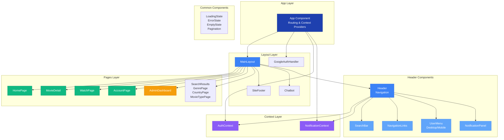
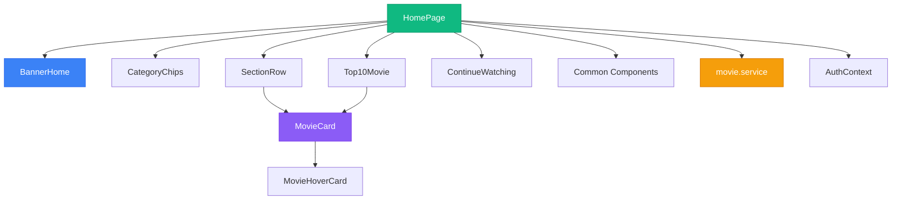
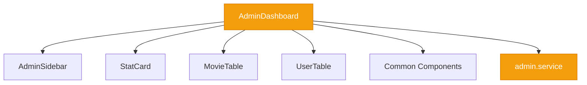
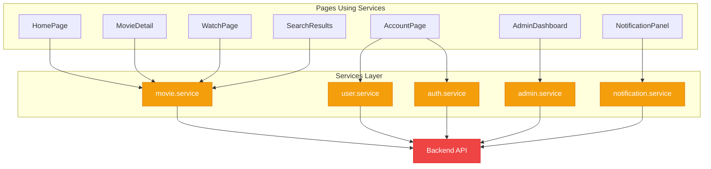

# Component Diagram - Frontend

## Tổng quan

Frontend của CinePhine được xây dựng bằng React với kiến trúc component-based, sử dụng React Router cho routing và Context API cho state management.

---

## Component Diagram

### Sơ đồ tổng quan (ASCII)

```
┌─────────────────────────────────────────────────────────────────┐
│                         App Component                           │
│  (Routing, Context Providers: AuthProvider, NotificationProvider)│
└─────────────────────────────────────────────────────────────────┘
                              │
                              ├────────────────────────────────────┐
                              │                                    │
                    ┌─────────▼─────────┐              ┌──────────▼──────────┐
                    │   MainLayout       │              │  GoogleAuthHandler  │
                    │  (Layout Wrapper)  │              │  (OAuth Callback)    │
                    └─────────┬──────────┘              └─────────────────────┘
                              │
        ┌─────────────────────┼─────────────────────┐
        │                     │                     │
┌───────▼────────┐   ┌────────▼────────┐   ┌────────▼────────┐
│    Header      │   │  Main Content   │   │  SiteFooter     │
│  (Navigation)  │   │   (Outlet)      │   │  (Footer Info)  │
└───────┬────────┘   └────────┬────────┘   └────────────────┘
        │                     │
        │                     │
        │         ┌───────────┼───────────┐
        │         │           │           │
        │   ┌─────▼─────┐ ┌──▼──┐ ┌─────▼─────┐
        │   │  HomePage  │ │ ... │ │ WatchPage │
        │   └───────────┘ └─────┘ └───────────┘
        │
        └───────────┐
                    │
        ┌───────────┼───────────┐
        │           │           │
┌───────▼─────┐ ┌───▼──────┐ ┌──▼──────────┐
│ SearchBar   │ │UserMenu  │ │Navigation   │
│ (Search)    │ │(Profile) │ │Links        │
└─────────────┘ └──────────┘ └─────────────┘
```

### Sơ đồ Mermaid - Tổng quan Frontend Component



## Mô tả các thành phần trong sơ đồ tổng quan

### 1. App Layer

#### App Component

- **Chức năng**: Component gốc của ứng dụng, quản lý routing và context providers
- **Nhiệm vụ chính**:
  - Cấu hình React Router để điều hướng giữa các trang
  - Cung cấp AuthContext và NotificationContext cho toàn bộ ứng dụng
  - Định nghĩa các route chính và protected routes
  - Xử lý OAuth callback từ Google

---

### 2. Context Layer

#### AuthContext

- **Chức năng**: Quản lý trạng thái xác thực người dùng trên toàn ứng dụng
- **Nhiệm vụ chính**:
  - Lưu trữ thông tin user hiện tại
  - Quản lý trạng thái đăng nhập/đăng xuất
  - Cung cấp các phương thức: login, logout, register, updateUser
  - Quản lý modal đăng nhập/đăng ký

#### NotificationContext

- **Chức năng**: Quản lý hệ thống thông báo toàn ứng dụng
- **Nhiệm vụ chính**:
  - Lưu trữ danh sách thông báo
  - Quản lý số lượng thông báo chưa đọc
  - Cung cấp các phương thức để thêm, xóa, đánh dấu đã đọc thông báo

---

### 3. Layout Layer

#### MainLayout

- **Chức năng**: Layout wrapper bao bọc tất cả các trang
- **Nhiệm vụ chính**:
  - Cung cấp cấu trúc layout chung (Header, Footer, Chatbot)
  - Sử dụng React Router Outlet để render các trang con
  - Đảm bảo layout nhất quán trên toàn ứng dụng

#### GoogleAuthHandler

- **Chức năng**: Xử lý callback từ OAuth Google
- **Nhiệm vụ chính**:
  - Nhận và xử lý token từ Google OAuth
  - Xác thực và đăng nhập người dùng
  - Chuyển hướng sau khi xác thực thành công

#### SiteFooter

- **Chức năng**: Footer của website
- **Nhiệm vụ chính**:
  - Hiển thị thông tin liên hệ, bản quyền
  - Cung cấp các liên kết hữu ích

#### Chatbot

- **Chức năng**: AI Chatbot hỗ trợ người dùng
- **Nhiệm vụ chính**:
  - Trả lời câu hỏi về phim
  - Hỗ trợ tìm kiếm và đề xuất phim
  - Tương tác với người dùng qua giao diện chat

---

### 4. Header Components

#### Header

- **Chức năng**: Component điều hướng chính của ứng dụng
- **Nhiệm vụ chính**:
  - Hiển thị logo và menu điều hướng
  - Quản lý trạng thái scroll để thay đổi style
  - Tích hợp các component con: SearchBar, NavigationLinks, UserMenu, NotificationPanel
  - Kết nối với AuthContext và NotificationContext

#### SearchBar

- **Chức năng**: Thanh tìm kiếm phim và diễn viên
- **Nhiệm vụ chính**:
  - Cho phép người dùng nhập từ khóa tìm kiếm
  - Hiển thị gợi ý tìm kiếm khi đang nhập
  - Chuyển hướng đến trang kết quả tìm kiếm

#### NavigationLinks

- **Chức năng**: Menu điều hướng chính
- **Nhiệm vụ chính**:
  - Hiển thị các liên kết: Trang chủ, Thể loại, Quốc gia, Loại phim
  - Responsive cho mobile và desktop
  - Highlight trang hiện tại

#### UserMenu

- **Chức năng**: Menu người dùng (Desktop/Mobile)
- **Nhiệm vụ chính**:
  - Hiển thị thông tin user và avatar
  - Dropdown menu với các tùy chọn: Tài khoản, Đăng xuất
  - Responsive: DesktopUserMenu và MobileUserMenu

#### NotificationPanel

- **Chức năng**: Panel hiển thị thông báo
- **Nhiệm vụ chính**:
  - Hiển thị danh sách thông báo
  - Đánh dấu đã đọc/ chưa đọc
  - Kết nối với NotificationContext để lấy dữ liệu

---

### 5. Pages Layer

#### HomePage

- **Chức năng**: Trang chủ của ứng dụng
- **Nhiệm vụ chính**:
  - Hiển thị banner phim nổi bật
  - Các section phim: Trending, New Releases, Top 10
  - Category chips để lọc theo thể loại
  - Section "Xem tiếp" cho user đã đăng nhập

#### MovieDetail

- **Chức năng**: Trang chi tiết phim
- **Nhiệm vụ chính**:
  - Hiển thị thông tin đầy đủ về phim
  - Danh sách diễn viên (Cast)
  - Danh sách tập phim (Episodes) cho phim bộ
  - Section bình luận
  - Responsive layout cho mobile và desktop

#### WatchPage

- **Chức năng**: Trang xem phim
- **Nhiệm vụ chính**:
  - Video player để phát phim
  - Chọn tập phim và loại audio (vietsub, thuyết minh, lồng tiếng)
  - Rating sidebar để đánh giá phim
  - Action bar: thêm vào yêu thích, watchlist
  - Section bình luận và cast

#### AccountPage

- **Chức năng**: Trang quản lý tài khoản
- **Nhiệm vụ chính**:
  - Quản lý thông tin profile
  - Quản lý thông tin tài khoản
  - Bảo mật: đổi mật khẩu, email
  - Danh sách yêu thích và watchlist
  - Tab thông báo
  - Section "Xem tiếp"

#### AdminDashboard

- **Chức năng**: Trang quản trị viên
- **Nhiệm vụ chính**:
  - Dashboard tổng quan với thống kê
  - Quản lý phim: thêm, sửa, xóa
  - Quản lý người dùng
  - Xem các báo cáo và thống kê

#### OtherPages (SearchResults, GenrePage, CountryPage, MovieTypePage)

- **Chức năng**: Các trang lọc và tìm kiếm phim
- **Nhiệm vụ chính**:
  - **SearchResults**: Hiển thị kết quả tìm kiếm với pagination
  - **GenrePage**: Lọc phim theo thể loại
  - **CountryPage**: Lọc phim theo quốc gia
  - **MovieTypePage**: Lọc phim theo loại (phim lẻ, phim bộ)

---

### 6. Common Components

#### LoadingState

- **Chức năng**: Hiển thị trạng thái loading
- **Nhiệm vụ chính**: Hiển thị spinner/loading indicator khi đang tải dữ liệu

#### ErrorState

- **Chức năng**: Hiển thị trạng thái lỗi
- **Nhiệm vụ chính**: Hiển thị thông báo lỗi khi có lỗi xảy ra

#### EmptyState

- **Chức năng**: Hiển thị trạng thái rỗng
- **Nhiệm vụ chính**: Hiển thị khi không có dữ liệu (ví dụ: không tìm thấy kết quả)

#### Pagination

- **Chức năng**: Phân trang
- **Nhiệm vụ chính**: Điều hướng giữa các trang khi danh sách quá dài

---

## Mối quan hệ giữa các thành phần

1. **App Component** là component gốc, cung cấp Context và quản lý routing
2. **MainLayout** bao bọc tất cả các trang và cung cấp Header, Footer, Chatbot
3. **Header** kết nối với Contexts để quản lý authentication và notifications
4. **Các Pages** được render thông qua React Router Outlet trong MainLayout
5. **Common Components** được sử dụng bởi tất cả các Pages để hiển thị trạng thái chung

### Sơ đồ Mermaid - Chi tiết HomePage Components



### Sơ đồ Mermaid - Chi tiết MovieDetail & WatchPage Components

```mermaid
graph TB
    subgraph "MovieDetail Page"
        MovieDetail[MovieDetail]
        MovieDetail --> MovieLayout[Mobile/Desktop Layout]
        MovieDetail --> CastSection1[CastSection]
        MovieDetail --> EpisodesSection1[EpisodesSection]
        MovieDetail --> CommentsSection1[CommentsSection]
        MovieDetail --> Common1[Common Components]
        MovieDetail --> movieService1[movie.service]
    end

    subgraph "WatchPage"
        WatchPage[WatchPage]
        WatchPage --> VideoPlayer[VideoPlayer]
        WatchPage --> ActionBar[ActionBar]
        WatchPage --> RatingSidebar[RatingSidebar]
        WatchPage --> EpisodesSection2[EpisodesSection]
        WatchPage --> CommentsSection2[CommentsSection]
        WatchPage --> MovieInfoBrief[MovieInfoBrief]
        WatchPage --> CastSection2[CastSection]
        WatchPage --> Common2[Common Components]
        WatchPage --> movieService2[movie.service]
    end

    style MovieDetail fill:#10b981,stroke:#059669,color:#fff
    style WatchPage fill:#10b981,stroke:#059669,color:#fff
    style movieService1 fill:#f59e0b,stroke:#d97706,color:#fff
    style movieService2 fill:#f59e0b,stroke:#d97706,color:#fff
```

### Sơ đồ Mermaid - Chi tiết AccountPage Components

```mermaid
graph TB
    AccountPage[AccountPage]

    AccountPage --> AccountSidebar[AccountSidebar]
    AccountPage --> ProfileCard[ProfileCard]
    AccountPage --> AccountInfoCard[AccountInfoCard]
    AccountPage --> SecurityCard[SecurityCard]
    AccountPage --> NotificationsTab[NotificationsTab]
    AccountPage --> ContinueWatchingSection[ContinueWatchingSection]

    AccountPage --> Common[Common Components]
    AccountPage --> userService[user.service]
    AccountPage --> authService[auth.service]
    AccountPage --> AuthContext[AuthContext]

    style AccountPage fill:#10b981,stroke:#059669,color:#fff
    style userService fill:#f59e0b,stroke:#d97706,color:#fff
    style authService fill:#f59e0b,stroke:#d97706,color:#fff
    style AuthContext fill:#8b5cf6,stroke:#7c3aed,color:#fff
```



### Sơ đồ Mermaid - Chi tiết AdminDashboard Components



### Sơ đồ Mermaid - Chi tiết Services & Backend



---

## Chi tiết các Component chính

### 1. App Component

**Mô tả**: Component gốc của ứng dụng, quản lý routing và context providers.

**Các class/component con**:

- `AuthProvider` (Context) - Quản lý authentication state
- `NotificationProvider` (Context) - Quản lý notification state
- `Router` - React Router configuration
- `Routes` - Route definitions
- `MainLayout` - Layout wrapper cho các trang
- `ProtectedRoute` - Route protection cho admin

**Dependencies**:

- `react-router-dom`
- `contexts/AuthContext`
- `contexts/NotificationContext`
- `layouts/MainLayout`
- `components/general/ProtectedRoute`

---

### 2. MainLayout Component

**Mô tả**: Layout chính bao bọc tất cả các trang, bao gồm Header, Footer và Chatbot.

**Các class/component con**:

- `Header` - Navigation header
- `SiteFooter` - Footer component
- `Chatbot` - Chatbot component
- `Outlet` - React Router outlet cho nested routes

**Dependencies**:

- `components/general/Header`
- `components/general/SiteFooter`
- `components/general/Chatbot`

---

### 3. Header Component

**Mô tả**: Component điều hướng chính, bao gồm logo, search bar, user menu và navigation links.

**Các class/component con** (gộp):

- `SearchBar` - Thanh tìm kiếm
- `NavigationLinks` - Menu điều hướng
- `DesktopUserMenu` - User menu cho desktop
- `MobileUserMenu` - User menu cho mobile
- `NotificationPanel` - Panel thông báo

**Dependencies**:

- `components/header/*`
- `components/notifications/NotificationPanel`
- `contexts/NotificationContext`
- `hooks/useAuth`

---

### 4. Pages Components

#### 4.1. HomePage

**Mô tả**: Trang chủ hiển thị banner, categories, và các section phim.

**Các class/component con** (gộp):

- `BannerHome` - Banner chính với thông tin phim nổi bật
- `CategoryChips` - Chips thể loại phim
- `SectionRow` - Các hàng section phim (Trending, New Releases, etc.)
- `Top10Movie` - Top 10 phim
- `ContinueWatching` - Section xem tiếp

**Dependencies**:

- `components/home-page/*`
- `components/banner/*`

---

#### 4.2. MovieDetail

**Mô tả**: Trang chi tiết phim với thông tin đầy đủ, cast, episodes, comments.

**Các class/component con** (gộp):

- `MobileLayout` - Layout cho mobile
- `DesktopLayout` - Layout cho desktop
- `MovieDetailContent` - Nội dung chi tiết phim
- `CastSection` - Section diễn viên
- `EpisodesSection` - Section tập phim
- `CommentsSection` - Section bình luận
- `ActionButtons` - Các nút hành động (favorite, watchlist)

**Dependencies**:

- `components/movie-detail/*`
- `hooks/useMovieDetail`
- `components/common/LoadingState`
- `components/common/ErrorState`

---

#### 4.3. WatchPage

**Mô tả**: Trang xem phim với video player, episodes, comments và rating.

**Các class/component con** (gộp):

- `VideoPlayer` - Video player component
- `ActionBar` - Thanh hành động (favorite, add to list)
- `RatingSidebar` - Sidebar đánh giá phim
- `EpisodesSection` - Section chọn tập phim
- `CommentsSection` - Section bình luận
- `MovieInfoBrief` - Thông tin phim ngắn gọn
- `CastSection` - Section diễn viên

**Dependencies**:

- `components/watch-page/*`
- `components/movie-detail/EpisodesSection`
- `components/movie-detail/CommentsSection`
- `components/movie-detail/CastSection`
- `services/movie.service`

---

#### 4.4. AccountPage

**Mô tả**: Trang quản lý tài khoản với các tab: profile, favorites, watchlist, notifications.

**Các class/component con** (gộp):

- `AccountSidebar` - Sidebar điều hướng tài khoản
- `ProfileCard` - Card thông tin profile
- `AccountInfoCard` - Card thông tin tài khoản
- `SecurityCard` - Card bảo mật (đổi mật khẩu, email)
- `NotificationsTab` - Tab thông báo
- `ContinueWatchingSection` - Section xem tiếp

**Dependencies**:

- `components/account/*`
- `components/notifications/NotificationsTab`
- `hooks/useAuth`
- `services/user.service`

---

#### 4.5. AdminDashboard

**Mô tả**: Trang quản trị viên với thống kê, quản lý phim và người dùng.

**Các class/component con** (gộp):

- `AdminSidebar` - Sidebar điều hướng admin
- `StatCard` - Card thống kê
- `MovieTable` - Bảng quản lý phim
- `UserTable` - Bảng quản lý người dùng

**Dependencies**:

- `components/admin/*`
- `services/admin.service`
- `components/common/LoadingState`

---

#### 4.6. SearchResults

**Mô tả**: Trang kết quả tìm kiếm với pagination.

**Các class/component con** (gộp):

- `MovieCard` - Card phim
- `Pagination` - Phân trang
- `EmptyState` - Trạng thái rỗng
- `ErrorState` - Trạng thái lỗi

**Dependencies**:

- `components/home-page/MovieCard`
- `components/common/*`
- `services/movie.service`

---

#### 4.7. GenrePage / CountryPage / MovieTypePage

**Mô tả**: Các trang lọc phim theo thể loại, quốc gia, loại phim.

**Các class/component con**:

- `FilteredMovies` - Component hiển thị danh sách phim đã lọc

**Dependencies**:

- `components/home-page/FilteredMovies`

---

### 5. Common Components

**Mô tả**: Các component tái sử dụng trong toàn bộ ứng dụng.

**Các class/component con** (gộp):

- `LoadingState` - Trạng thái loading (BarSpinner, etc.)
- `ErrorState` - Trạng thái lỗi
- `EmptyState` - Trạng thái rỗng
- `Pagination` - Phân trang
- `ScrollContainer` - Container có scroll
- `OptimizedImage` - Image tối ưu
- `Toast` / `ToastContainer` - Thông báo toast
- `WithHoverCard` - HOC cho hover card

**Dependencies**:

- Không có dependencies ngoài React

---

### 6. Movie Components

#### 6.1. MovieCard

**Mô tả**: Card hiển thị thông tin phim với hover effect.

**Các class/component con** (gộp):

- `MovieHoverCard` - Card hiển thị khi hover
- `HoverCardHeader` - Header của hover card
- `HoverCardInfo` - Thông tin phim trong hover card
- `HoverCardGenres` - Thể loại trong hover card
- `HoverCardActions` - Các hành động trong hover card

**Dependencies**:

- `components/movie-card/*`
- `hooks/useMovieHover`

---

#### 6.2. Banner Components

**Mô tả**: Các component cho banner phim nổi bật.

**Các class/component con** (gộp):

- `BannerBackground` - Background của banner
- `BannerContent` - Nội dung banner
- `MovieTitle` - Tiêu đề phim
- `MovieInfo` - Thông tin phim
- `MovieDescription` - Mô tả phim
- `ActionButtons` - Các nút hành động
- `GenreList` - Danh sách thể loại

**Dependencies**:

- `components/banner/*`

---

### 7. Services Layer

**Mô tả**: Các service gọi API đến backend.

**Các class/service**:

- `auth.service` - Authentication service
- `movie.service` - Movie service
- `user.service` - User service
- `admin.service` - Admin service
- `notification.service` - Notification service
- `health.service` - Health check service

**Dependencies**:

- `lib/axios` - Axios instance
- `services/utils/apiRequest` - API request utilities

---

### 8. Contexts Layer

**Mô tả**: Context providers cho state management.

**Các class/context**:

- `AuthContext` - Authentication context
  - Quản lý user state
  - Quản lý authentication state
  - Cung cấp auth methods (login, logout, register)
- `NotificationContext` - Notification context
  - Quản lý notification state
  - Cung cấp notification methods

**Dependencies**:

- `lib/auth-storage` - Local storage utilities
- `services/auth.service`
- `services/notification.service`

---

### 9. Hooks Layer

**Mô tả**: Custom hooks tái sử dụng logic.

**Các class/hook**:

- `useAuth` - Hook cho authentication
- `useMovieDetail` - Hook cho movie detail
- `useMovieHover` - Hook cho movie hover effect
- `useMovieRating` - Hook cho rating phim
- `useMovieTaxonomies` - Hook cho taxonomies (genres, countries)
- `usePagination` - Hook cho pagination
- `useToast` - Hook cho toast notifications
- `useImagePreloader` - Hook cho preload images
- `useFilterOptions` - Hook cho filter options

**Dependencies**:

- `contexts/AuthContext`
- `services/*`

---

### 10. Utils Layer

**Mô tả**: Các utility functions.

**Các class/utility**:

- `imagePreloader` - Preload images
- `seriesGrouping` - Group series movies
- `slugify` - Convert string to slug
- `ultils` - General utilities

**Dependencies**:

- Không có dependencies ngoài JavaScript standard library

---

## Sơ đồ phụ thuộc chính

```
App
├── MainLayout
│   ├── Header
│   │   ├── SearchBar
│   │   ├── NavigationLinks
│   │   ├── DesktopUserMenu / MobileUserMenu
│   │   └── NotificationPanel
│   ├── Pages (Outlet)
│   │   ├── HomePage
│   │   │   ├── BannerHome
│   │   │   ├── CategoryChips
│   │   │   ├── SectionRow
│   │   │   ├── Top10Movie
│   │   │   └── ContinueWatching
│   │   ├── MovieDetail
│   │   │   ├── MobileLayout / DesktopLayout
│   │   │   ├── CastSection
│   │   │   ├── EpisodesSection
│   │   │   └── CommentsSection
│   │   ├── WatchPage
│   │   │   ├── VideoPlayer
│   │   │   ├── ActionBar
│   │   │   ├── RatingSidebar
│   │   │   ├── EpisodesSection
│   │   │   └── CommentsSection
│   │   ├── AccountPage
│   │   │   ├── AccountSidebar
│   │   │   ├── ProfileCard
│   │   │   ├── AccountInfoCard
│   │   │   ├── SecurityCard
│   │   │   └── NotificationsTab
│   │   ├── AdminDashboard
│   │   │   ├── AdminSidebar
│   │   │   ├── StatCard
│   │   │   ├── MovieTable
│   │   │   └── UserTable
│   │   └── SearchResults / GenrePage / CountryPage / MovieTypePage
│   │       └── FilteredMovies
│   ├── SiteFooter
│   └── Chatbot
├── Contexts
│   ├── AuthContext
│   └── NotificationContext
└── Services
    ├── auth.service
    ├── movie.service
    ├── user.service
    ├── admin.service
    └── notification.service
```

---

## Class Diagram cho các Component chính

### AuthContext Class

```
┌─────────────────────┐
│   AuthContext        │
├─────────────────────┤
│ + user: User         │
│ + isAuthenticated    │
│ + isLoading         │
│ + showAuthModal     │
│ + authMode          │
├─────────────────────┤
│ + login()           │
│ + logout()          │
│ + register()        │
│ + updateUser()      │
│ + openAuthModal()   │
│ + closeAuthModal()  │
└─────────────────────┘
```

### MovieDetail Hook

```
┌─────────────────────┐
│  useMovieDetail     │
├─────────────────────┤
│ + movie: Movie      │
│ + loading: boolean  │
│ + error: string     │
│ + activeTab         │
│ + audioType         │
├─────────────────────┤
│ + setActiveTab()    │
│ + setAudioType()    │
│ + fetchMovie()      │
└─────────────────────┘
```

### MovieService Class

```
┌─────────────────────┐
│   MovieService      │
├─────────────────────┤
│ - axios: AxiosInstance│
├─────────────────────┤
│ + fetchMovies()     │
│ + fetchMovieById()  │
│ + search()          │
│ + fetchEpisodes()   │
│ + incrementView()  │
│ + getTopMovies()   │
└─────────────────────┘
```

---

## Ghi chú

1. **Component Grouping**: Các component nhỏ đã được gộp vào component cha để tránh phức tạp:

   - Banner components được gộp vào `BannerHome`
   - Movie card components được gộp vào `MovieCard`
   - Header components được gộp vào `Header`
   - Common components được nhóm lại thành một layer

2. **Mock Files**: Đã bỏ qua các file mock theo yêu cầu.

3. **Dependencies**:

   - React Router cho routing
   - Context API cho state management
   - Axios cho API calls
   - Custom hooks cho logic tái sử dụng

4. **Architecture Pattern**:
   - Component-based architecture
   - Separation of concerns (Pages, Components, Services, Hooks, Utils)
   - Context API cho global state
   - Custom hooks cho business logic
